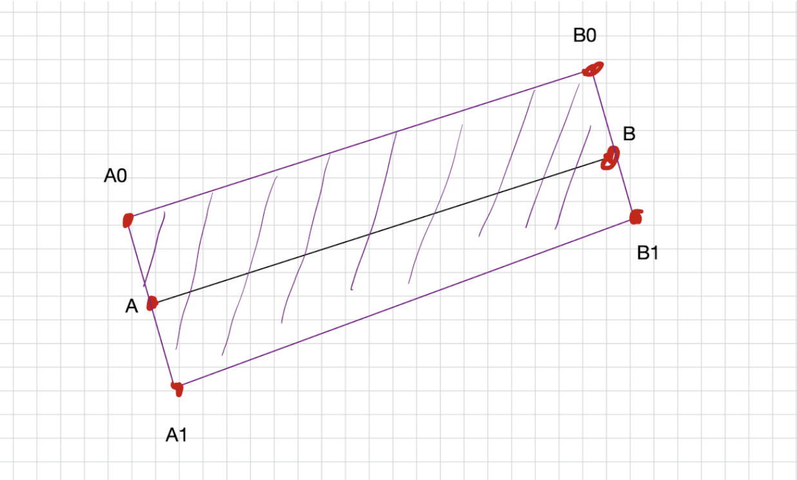
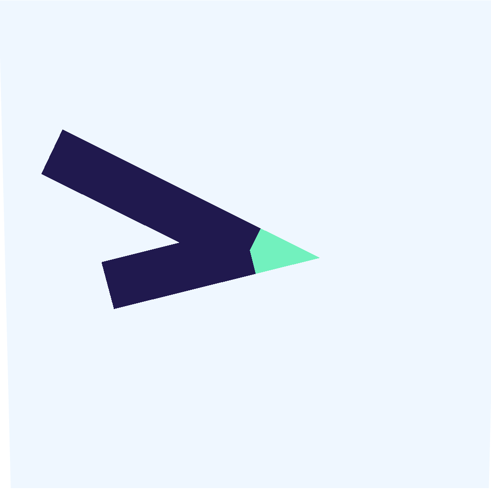

# Vitaliy Dimov GFX Task Report

## Contents 
- [Vitaliy Dimov GFX Task Report](#vitaliy-dimov-gfx-task-report)
  - [Contents](#contents)
  - [Setup](#setup)
    - [My tools](#my-tools)
    - [Cloning the repository \& and install dependencies](#cloning-the-repository--and-install-dependencies)
    - [FIX update the uLineJoinType uniform](#fix-update-the-ulinejointype-uniform)
  - [Joints](#joints)
    - [Preparation](#preparation)
      - [Add animation to the control panel](#add-animation-to-the-control-panel)
      - [Adjust shader code](#adjust-shader-code)
    - [Rectangle ( without joint )](#rectangle--without-joint-)
    - [Bevel joint](#bevel-joint)
    - [Miter joint](#miter-joint)
  - [Performance Optimization](#performance-optimization)
    - [Measure the performance](#measure-the-performance)
    - [Instancing](#instancing)
    - [Shader optimization](#shader-optimization)

## Setup

### My tools
- Editor: Visual Studio Code
- Additional tools: Github Copilot
- OS: MacOS Big Sur
- Browser: Google Chrome
- Device: MacBook Pro M1 15-inch 2021

### Cloning the repository & and install dependencies
Clone the repository, install dependencies, and run the development server.

<p align="center">
    
</p>
Here our starting point is a red line with a round join type. 
Also we have a control panel located at the top right corner, allowing us to change the line join type, and performance testing option to render 1,000 objects.

<br>

Also we have the some shader unifrorms:
```typescript
    uPointA: new Uniform(new Vector2(0.1, 0.7)),
    uPointB: new Uniform(new Vector2(0.7, 0.7)),
    uPointC: new Uniform(new Vector2(0.1, 0.1)),
    uThickness: new Uniform(0.1),
    uLineJoinType: new Uniform(lineJoinType),
    uColor: new Uniform(color ?? new Vector3(1, 0, 0)),
```

NOTE: I saw the code inside the template project, and based on that, I will implement my solution assuming that I should change only the shader code and make minimal changes to the rest of the code. With these assumptions, I will implement all line joint types using just the fragment shader, as it is implemented in the example code with round joints. 


### FIX update the uLineJoinType uniform

During the development I found the bug ( or it is a part of the task ) that the uLineJoinType uniform is not updated when we change the line join type.

I add debug log to PlaneMesh component. 

<p align="center">
    
</p>

When I change the joint type, the log is show in my console. But uLineJoinType uniform is not updated.

It looks like after compiling the shader, r3f does not recognize that our uniform has been updated. Each time the value updates, React tries to re-render the component, causing the creation of new uniforms. Instead of creating new uniforms, we need to update the existing ones. To fix this problem, we should use useMemo. [link](https://blog.maximeheckel.com/posts/the-study-of-shaders-with-react-three-fiber/)

FIX: 
1. Add ref to shaderMaterial 
```typescript 
    const refShaderMaterial = useRef<ShaderMaterial>(null)
```
2. Apply useMemo to uniforms 
```typescript 
const uniforms = useMemo(
   () => ({
     uPointA: new Uniform(new Vector2(0.1, 0.7)),
     uPointB: new Uniform(new Vector2(0.7, 0.7)),
     uPointC: new Uniform(new Vector2(0.1, 0.1)),
     uThickness: new Uniform(0.1),
     uLineJoinType: new Uniform(lineJoinType),
     uColor: new Uniform(color ?? new Vector3(1, 0, 0)),
   }),
   []
 )
```
3. If ref exist update the uniforms. 
```typescript
if (refShaderMaterial.current) {
    refShaderMaterial.current.uniforms.uLineJoinType.value = lineJoinType;
}
```

After this fix, the uLineJoinType uniform is updated when we change the line join type. 


## Joints

### Preparation 

#### Add animation to the control panel
Line could be joined in different angles. To see the difference between the joints, I will add animation to the control panel.

<p align="center">
    
</p>

And for this animate check box start working, I will move the C point in PlaneMesh component. 
```typescript
useFrame(() => {
    if (!refShaderMaterial.current) return
    if (!animate) return

    refShaderMaterial.current.uniforms.uPointC.value.x =
      Math.sin(Date.now() / 1000) * 0.3 + 0.5
    refShaderMaterial.current.uniforms.uPointC.value.y =
      Math.cos(Date.now() / 1000) * 0.3 + 0.5
  })
```

This is helpful to see that line joints are working correctly in different angles.

####  Adjust shader code 

Separate the each joint type in different functions.

```glsl
void main() {
 if(uLineJoinType == 1){
     gl_FragColor = drawRound();
 } else if(uLineJoinType == 2) {
     gl_FragColor = drawMiter();
 } else {
     gl_FragColor = drawBevel();
 }
}
```

### Rectangle ( without joint )

For start lets implement drawing rectangle around each shader without joint. It's simple to implement. And need for both of miter and bevel joints. 

<p align="center">
    
</p>

For draw the rectangle, around the segment in fragment shader, we need to answer a question: "The current pixel is inside the segment rectangle or not?".

It be a function that get as argue the current pixel position, point A, point B, and the thickness of the line. 

```glsl
bool isInsideSegmentRectangle(vec2 p, vec2 a, vec2 b, float thickness) {
  vec2 pa = p - a;
  vec2 ba = b - a;

  // not normalized projection to segment
  float h = dot(pa, ba) / dot(ba, ba); 

  // distance to segment
  float len = length(pa - ba * clamp(h, 0.0, 1.0));

  // if point projection is inside segment and distance to segment is less than half thickness 
  // then point is inside rectangle
  return h > 0.0 && h < 1.0 && len < thickness / 2.0;
}
```

The algorithm: do the projection of the point to the segment, calculate the distance to the segment, and check if the point is inside the segment rectangle.

Now apply this function to the drawMiter to saw the result on the screen. 

```glsl
vec4 drawMiter() {
  bool isInsideAB = isInsideSegmentRectangle(vUv, uPointA, uPointB, uThickness);
  bool isInsideBC = isInsideSegmentRectangle(vUv, uPointB, uPointC, uThickness);

  if(isInsideAB || isInsideBC) {
    return vec4(uColor, 1.0);
  }

  return vec4(0., 0.2, float(uLineJoinType), 0.3);
}
```

For each pixel, we check if it is inside the rectangle of the segment AB or BC. If it is inside, we return the color of the line, otherwise, we return the color of the background.

Here the result: 

<p align="center">
    
    
    
</p>

### Bevel joint

I start from the bevel joint because it is the part of the miter joint. I'll explain...

<p align="center">
    
</p>

The bevel joint is the part of the miter joint. Bevel joint is a triangle B0B3B. The miter joint contain the bevel joint/triangle and also contain the triangle B0MB3. ( M do not present on this image, i talk about miter point later )

Use the same principle as for the rectangle. I need implement the function that check if the current pixel is inside the bevel joint or not, or if rephrase the current pixel is inside the triangle B0B3B or not. 

Let's implement the function that checks if the current pixel is inside the triangle. I plan to implement in two step. First implement function that say the point left or right from the segment. And then implement the function that check if the point is inside the triangle. [link](https://stackoverflow.com/questions/1560492/how-to-tell-whether-a-point-is-to-the-right-or-left-side-of-a-line)

```glsl 
float side(vec2 a, vec2 b, vec2 c) {
  return ((b.x - a.x) * (c.y - a.y) - (b.y - a.y) * (c.x - a.x));
}
```

NOTE: I do not use the standard glsl cross function because this function work only with vec3 and I need to work with vec2. [link](https://registry.khronos.org/OpenGL-Refpages/gl4/html/cross.xhtml)

Now implement the function that check if the point is inside the triangle. 

```glsl
bool isInsideTriangle(vec2 p, vec2 a, vec2 b, vec2 c) {
  bool sideAB = side(a, b, p) > 0.0;
  bool sideBC = side(b, c, p) > 0.0;
  bool sideCA = side(c, a, p) > 0.0;

  return sideAB == sideBC && sideBC == sideCA;
}
```

If the side function sign is the same for all sides of the triangle, then the point is inside the triangle.

Not for draw the bevel joint we need to compute to point B0 and B3. Point B we already have. 

B0 is the point that shift by half of the thickness from the point B in the direction of normal to AB. B3 the same but relative to BC. 


```glsl
bool isInsideBevelJoint(vec2 p, vec2 a, vec2 b, vec2 c, float thickness) {
  // Get normals to segments AB and BC
  vec2 ab = normalize(b - a);
  vec2 normalAB = vec2(ab.y, -ab.x);

  vec2 bc = normalize(c - b);
  vec2 normalBC = vec2(bc.y, -bc.x);

  // Get direction of the joint
  float directon = sign(side(a, b, c));

 // get b0 or b1 point depending on direction
  vec2 b1 = b + directon * normalAB * thickness / 2.;

  // get b3 or b2 point depending on direction
  vec2 b2 = b + directon * normalBC * thickness / 2.;

  return isInsideTriangle(p, b, b2, b1);
}
```
The code looks self explanatory. But I understand that "b3 or b2 point depending on direction" could be confusing. Look to the picture above, we have five B points. B0, B1, B2, B3, and B. And depending on the direction of the joint, we need to choose the right B points. 

Now apply this function to the drawBevel function. 

```glsl
vec4 drawBevel() {
  // Draw the rectangles for the segments
  bool isInsideAB = isInsideSegmentRectangle(vUv, uPointA, uPointB, uThickness);
  bool isInsideBC = isInsideSegmentRectangle(vUv, uPointB, uPointC, uThickness);

  if(isInsideAB || isInsideBC) {
    return vec4(uColor, 1.0);
  }

  // Draw the bevel joint
  if(isInsideBevelJoint(vUv, uPointA, uPointB, uPointC, uThickness)) {
    return vec4(uJointColor, 1.0);
  }

  // If not a part of the line, return background color
  return vec4(0., 0.2, 1.0, 0.3);
}
```

Here the result:

<p align="center">
    
    
    
</p>

The bevel joint is working correctly.

### Miter joint

The miter joint be implement similar to the bevel joint. The difference is that the miter joint is a triangle B0MB3. The point M is the intersection point of the A0B0 and C1C0 lines. ( or A1B1 and C0B2 depending on the direction of the joint )

<p align="center">
    
</p>

How to compute the B0 and B3 points we already know. Need to compute the position of the M point.

NOTE: During the first attempt to implement the miter joint, I compute the M point though the intersection of to lines set by two point each. But I think the solution with vectors is more elegant. [link](https://en.wikipedia.org/wiki/Line%E2%80%93line_intersection)

<p align="center">
    
</p>

To compute point M, I will get the normalized vector BM for the direction relative to point B, and then get the length of BM from cos(α/2)×∣BB3∣.

First compute the B0 and B3 points.
```glsl
float directon = sign(side(a, b, c));

vec2 ab = normalize(a - b);
vec2 normalAB = vec2(-ab.y, ab.x);
vec2 b0 = b + directon * normalAB * thickness / 2.;

vec2 bc = normalize(b - c);
vec2 normalBC = vec2(-bc.y, bc.x);
vec2 b3 = b + directon * normalBC * thickness / 2.;
```

After we get point B0 and B3 we can compute the normalize vectors BB0 and BB3.

```glsl
vec2 bb0 = normalize(b - b0);
vec2 bb3 = normalize(b - b3);
```

And then in three line we compute the M point

```glsl
vec2 miter = normalize(bb0 + bb3);
float miterLength = 0.5 * thickness / dot(miter, normalAB);

vec2 m = b + miter * miterLength * directon;
```
BM is a hypotenuse of the triangle BB0M. 
The hypotenuse can be computed thought divide the adjacent to the cos(α), by definition of the [cosinus](https://en.wikipedia.org/wiki/Sine_and_cosine#Definitions). 

<p align="center">
    
</p>

The alpha is the angle between the BB0 and BM. The cos(α) = dot(BM, normalAB) because the Bm and normalAB are normalized vectors, and module of the normalized vector is 1.

<p align="center">
    
</p>

Now the point M is computed. I use the same function that we use for bevel, isInsideTriangle, to draw all pixels that are inside the triangles B0B3M and B0B3B.

```glsl
if(isInsideTriangle(p, b0, b3, m) || isInsideTriangle(p, b0, b3, b)) {
    return true;
}

return false;
```

Now apply this function to the drawMiter function. 

```glsl
vec4 drawMiter() {
  bool isInsideAB = isInsideSegmentRectangle(vUv, uPointA, uPointB, uThickness);
  bool isInsideBC = isInsideSegmentRectangle(vUv, uPointB, uPointC, uThickness);

  if(isInsideAB || isInsideBC) {
    return vec4(uColor, 1.0);
  }

  if(isInsideMiterJoint(vUv, uPointA, uPointB, uPointC, uThickness)) {
    return vec4(uJointColor, 1.0);
  }

  return vec4(0., 0.2, 1.0, 0.3);
}
```

Here the result:

<p align="center">
    
    
    
</p>

The miter joint is working. However, as we observed in the second picture, sometimes the miter point is too far away, which looks strange. If this were a real development process, I would communicate with the manager or relevant stakeholders to update the expected behavior for this case.

## Performance Optimization

### Measure the performance

### Instancing 

### Shader optimization


<style>
	img{
        object-fit: contain;
    }
</style>